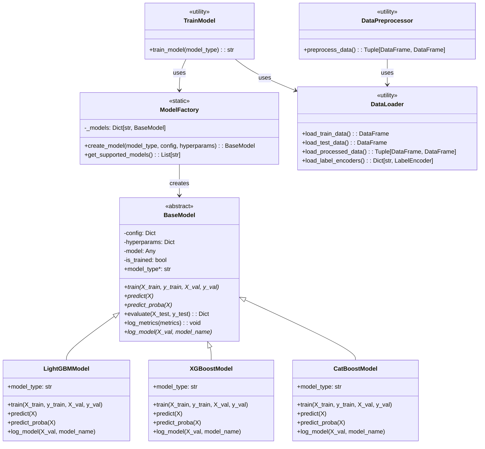
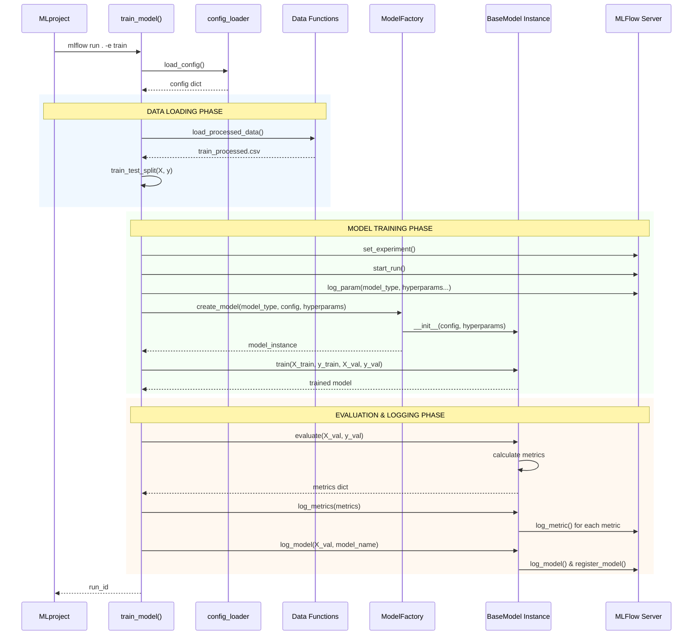

# Project Architecture

## UML Class Diagram

!!! info "Extensible Architecture"
    The system uses the **Factory Pattern** combined with **configuration-driven design** to make adding new machine learning models effortless. The `ModelFactory` maintains a registry of available models, while hyperparameters are centralized in `config.yaml`. To add a new model (e.g., RandomForest), you simply:
    
    1. Create a new class inheriting from `BaseModel` 
    2. Add it to the factory's `_models` dictionary
    3. Define its hyperparameters in the config file
    4. The model immediately becomes available through MLflow entry points
    
    This design separates algorithm implementation from pipeline orchestration, enabling rapid experimentation without modifying core training logic.




## UML Sequence Diagram - Training Pipeline



## Module Structure

```
src/
├── data/
│   ├── __init__.py
│   ├── load_data.py         # Data loading functions
│   └── preprocess.py        # Data preprocessing functions  
├── models/
│   ├── __init__.py
│   ├── core/
│   │   ├── base_model.py    # BaseModel abstract class
│   │   └── model_factory.py # ModelFactory static class
│   ├── implementations/
│   │   ├── catboost_model.py    # CatBoostModel class
│   │   ├── lightgbm_model.py    # LightGBMModel class
│   │   └── xgboost_model.py     # XGBoostModel class
│   ├── predict_model.py     # Prediction functions
│   └── train_model.py       # Training functions
│
config/
├── config.yaml              # Main configuration file
└── config_loader.py         # Configuration loading functions

MLproject                   # MLFlow project definition
main.py                     # Main pipeline runner
```

## Design Patterns Used

### Factory Pattern
- **ModelFactory**: Creates model instances based on string identifiers
- Static method approach with dictionary mapping
- Supports easy addition of new model types
- Encapsulates model instantiation logic

### Template Method Pattern  
- **BaseModel**: Abstract class defining training/prediction workflow
- Concrete implementations provide algorithm-specific details
- Ensures consistent interface across all models
- Common evaluation logic in base class

### Strategy Pattern
- **Model Implementations**: Interchangeable algorithms (LightGBM, XGBoost, CatBoost)
- Runtime selection of training strategy based on configuration
- Consistent evaluation metrics across strategies

