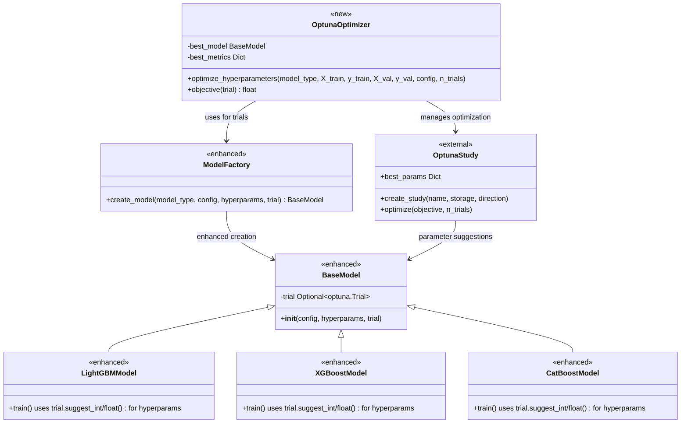
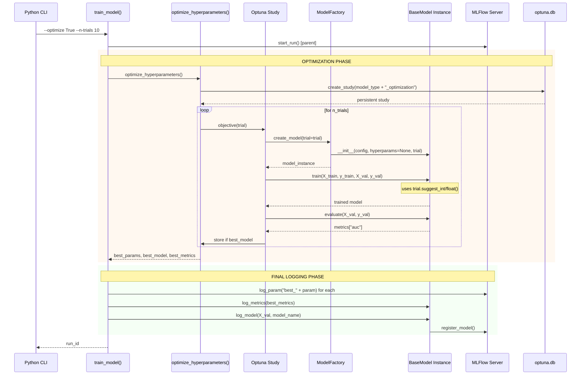

# Architecture Changes - V2.0

!!! info "Optuna Integration Architecture"
    V2.0 extends the model hierarchy with `trial` parameter support, enabling the replacement of hardcoded values with automated parameter suggestions.
    
## UML Class Diagram - New Components

## UML Sequence Diagram - Hyperparameter Optimization Pipeline

## New Components Added

V2.0 extends the existing architecture with two new classes:

- **OptunaOptimizer**: Manages the hyperparameter search process
- **OptunaStudy**: External Optuna study for persistent optimization history

## Storage Architecture

### Persistent Optimization Studies
- **Database**: `optuna.db` (SQLite) for study persistence
- **Study Names**: `{model_type}_optimization` (e.g., `lightgbm_optimization`)
- **Knowledge Accumulation**: Trials build upon previous optimization history
- **Concurrent Safe**: Multiple training sessions can add trials to existing studies